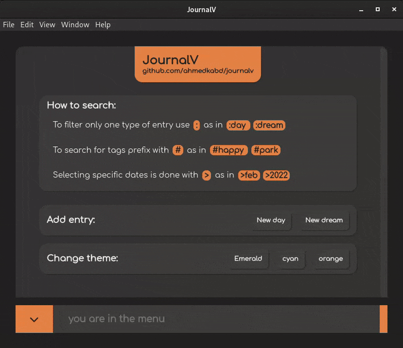

### JournalV

App for journaling your days and dreams, being made with ~~Electron~~ Tauri and Vue.


<hr />

### Features

- Add entries for your days to the journal.
- Do dream journaling and keep the contents of your dreams.
- Search through your entries for tags and titles, and look back on them.

<hr />

### Install

- Grab a binary from the [releases page](https://github.com/ahmedkabd/journalv/releases) (builds are automated, and not tested currently).
- Clone repo, go into, and run ```npm run tauri build```. Finished binaries will be in the target directory.
<hr />

### Preview

- General interface:

  

<hr />
