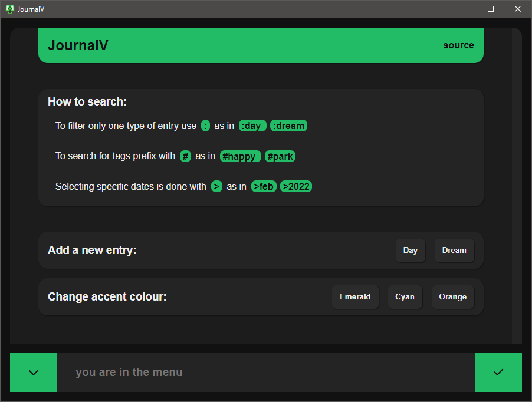
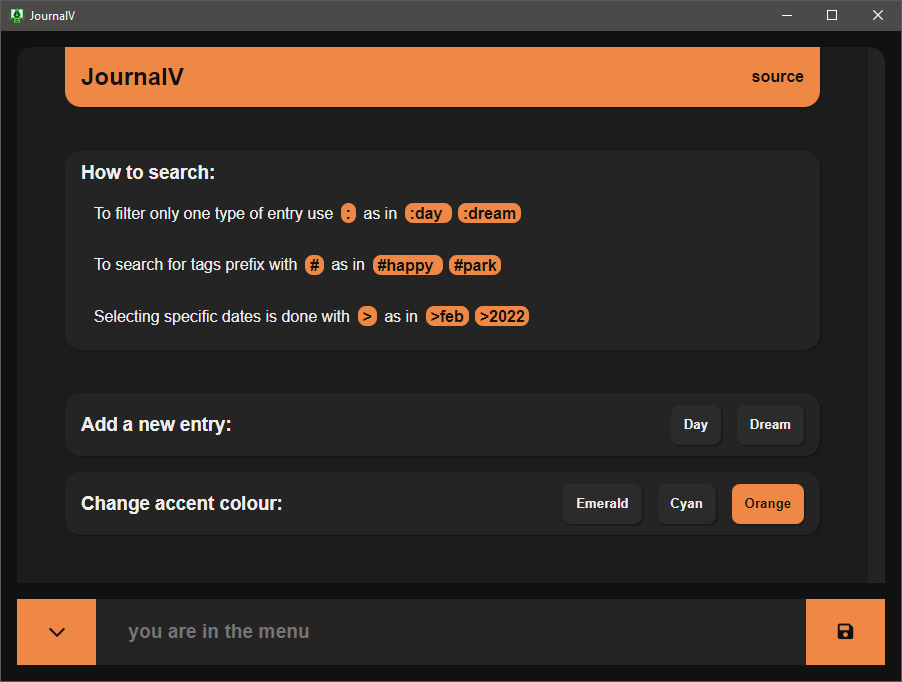
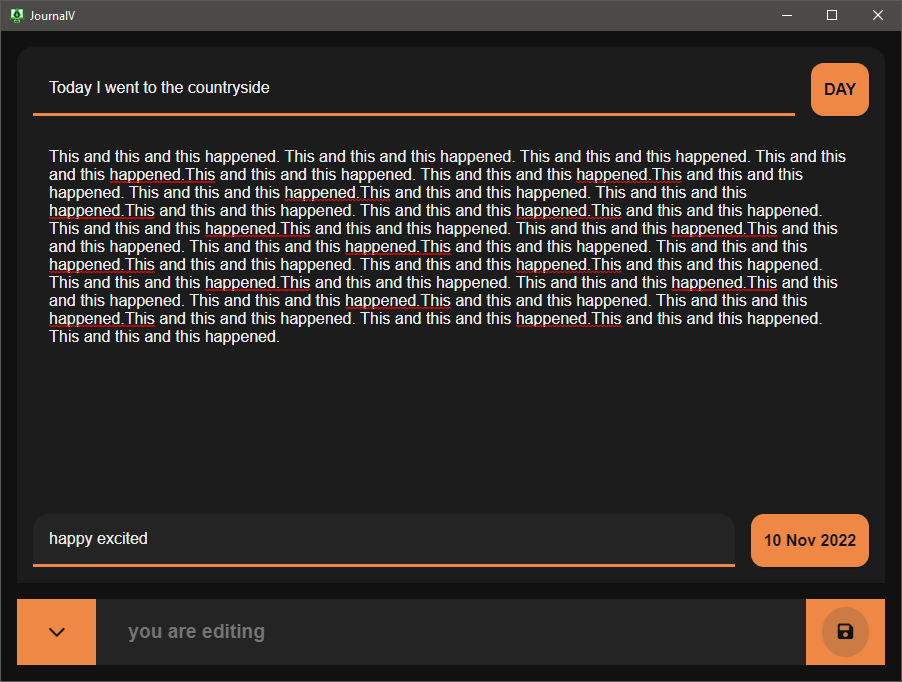
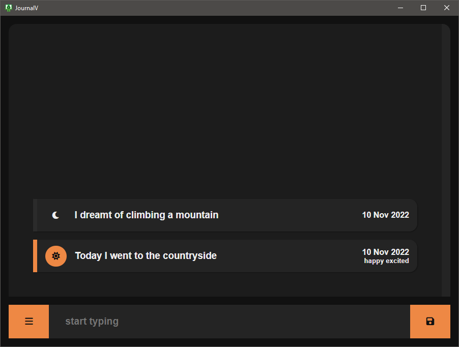
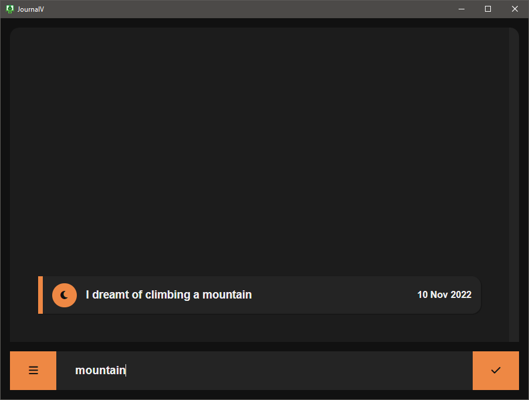
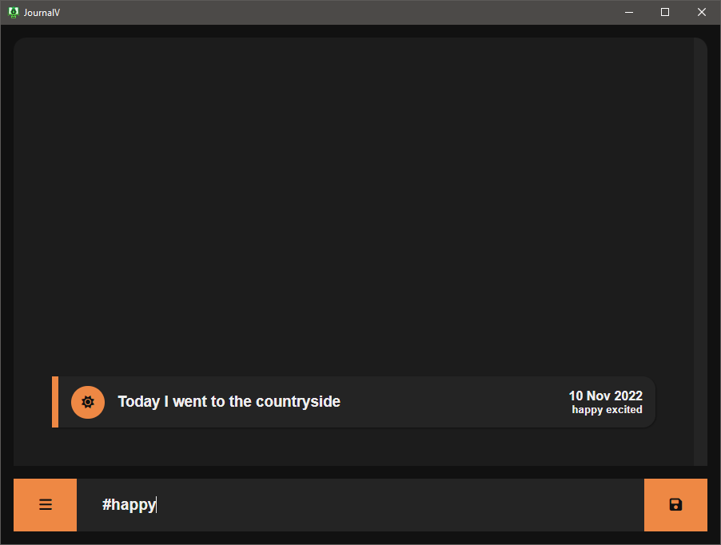
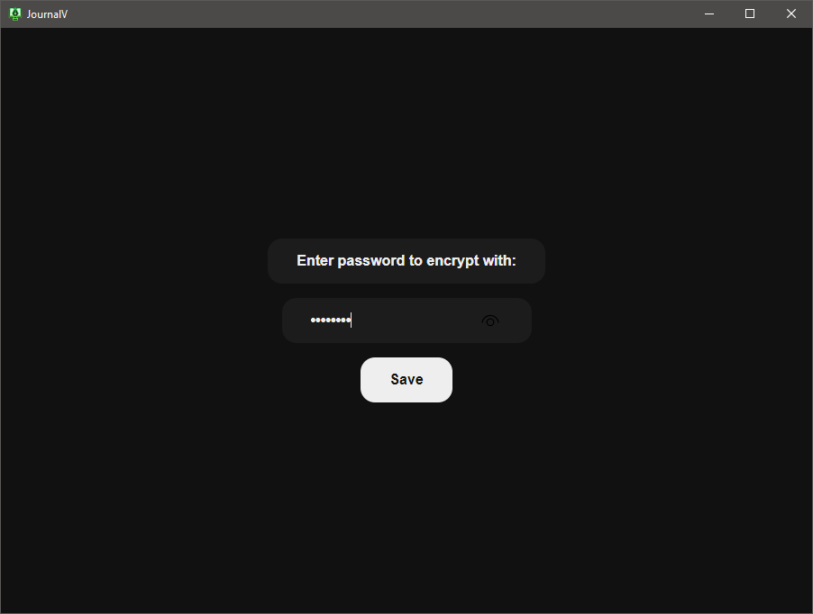

### JournalV

Journaling app for your days and dreams, being built with ~~Electron~~ Tauri and Vue.

 

 

### Features

- Add entries for your days to the journal.
- Do dream journaling and keep the contents of your dreams.
- Search through your entries for tags and titles, and look back on them.

 

 

### Install

There are two ways to get the app:

1. Grab a binary from the [releases page](https://github.com/ahmedkapro/journalv/releases) (builds are automated, and not tested currently).
2. Clone repo, go into, and run `npm run tauri build`. Finished binaries will be in the target directory.

 

 

### Preview

Here we go through some of the app screens and the showcase the features graphically.

- The main menu of the app, containing tips and options:

  

- We can change the accent colour here:

  

- Also can add entries, which we have here, adding a title and some content:

  

- We can add tags to entries, too, for easy searches:

  

- The search screen displays all entries stored, and search can be done through them:

  

- Just typing will search through the titles only:

  

- We can search using tags with the '#' prefix (other prefixes can be found in the menu):

  

- Saving and loading data depends on your password:

  
